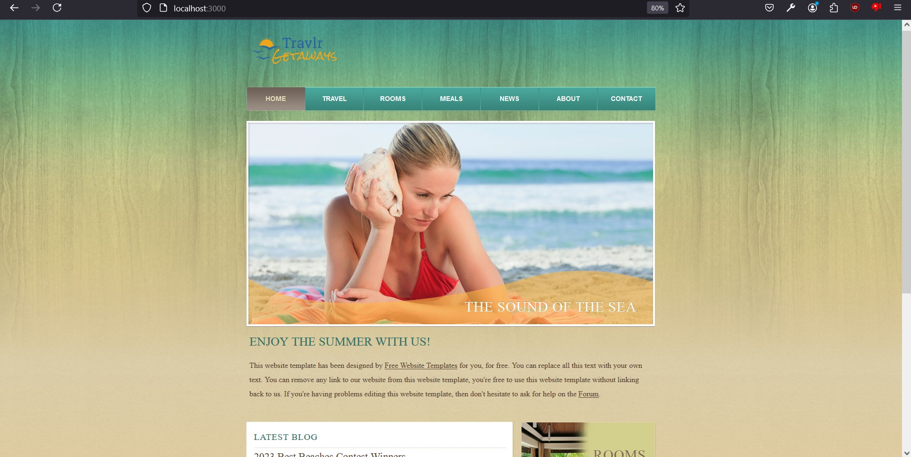
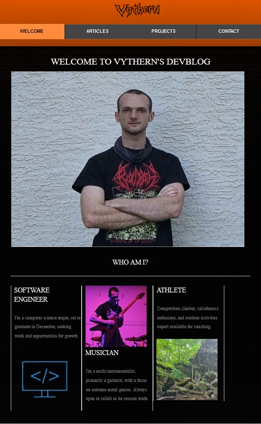
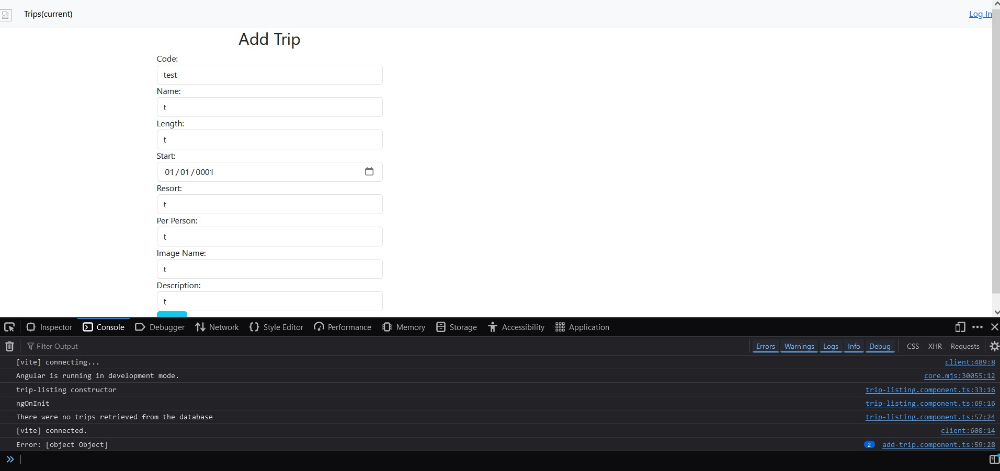
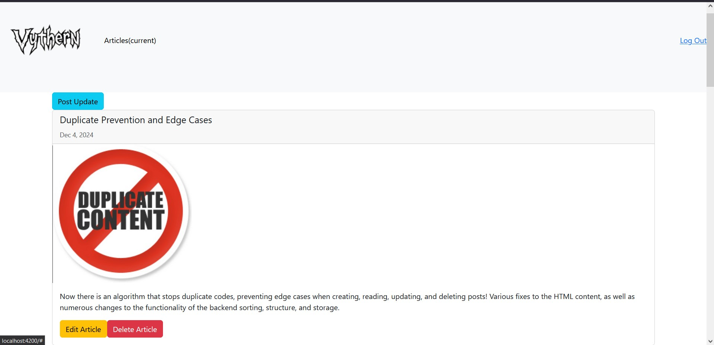
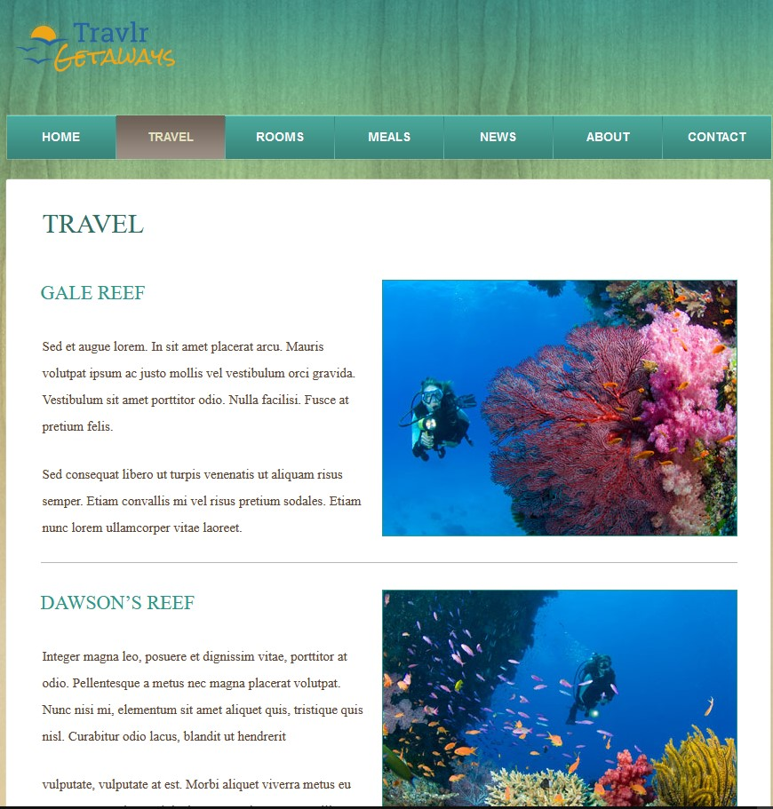
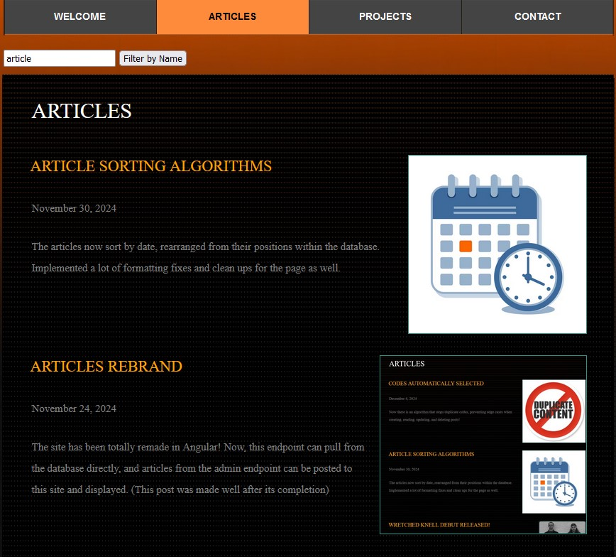

# Vythern.github.io
The E-portfolio of Nate Dukes, dedicated to showing off the work done in the Southern New Hampshire University Capstone project.  The SNHU capstone is the culmination of all the hard work and progress made over the span of my computer science degree.  

## Self-Assessment
  I think that an important part of self assessment is addressing weakness, and improving upon it.  For starters, I was originally a student at an in-person college before making the transfer to Southern New Hampshire University's online degree program, having made the transfer during the Covid pandemic.  Without in person lectures and connections, I sometimes felt less dedicated, or that my efforts were not as strong.  In these instances it seemed like I may have scraped by without learning or challenging myself to be my best.  The capstone felt like an opportunity to prove to myself, and to everyone else, that I have what it takes to go the distance, to improve, learn, reflect, and truly innovate.  

  The capstone progress I made is representative of this- taking a major assignment where I felt that I had underperformed, and totally transforming it, in all of the key software engineering criteria.  Over the past eight weeks, I have learned and implemented a multitude of different strategies, showcasing my development and knowledge of data structures and software architecture, database operations, code efficiency and cleanliness, and software security.  

  Besides my efforts in the capstone, I have also worked towards improving skills in design, documentation, diagramming, and creative solutions for various companies and teams.  Many of the courses at SNHU culminate in a professional submission to "shareholders," possible organizations, or include elements of communication with other working members and collaboration- the importance of working with others in a concise and professional manner is clear- which are showcased in the various designs and documentations completed in other courses (which can be found under my github repositories:  [github.com/Vythern/](url))

## "Artifacts" / Code Review
For the capstone, the artifacts for enhancement I chose were all for a major final project assignment from my CS-465 course.  The final week of that course dealt with implementing security, which I was unable to do, and the implementation of the system also ended up with a large portion of the codebase becoming non-functional.  The login system and authentication were completely useless.  There were no features for creating, reading, updating, or deleting from the admin database, which itself was not even functionally linked to the rest of the site.  The site had various bugs and missing content, a complete lack of use for many of the pages, and overall was poorly done in just about every category.  

Despite this, and a poor experience with frontend design aspects frustrating me to no end, and having forgotten pretty much every bit of detail of the design, I decided that this would be the artifact I chose for enhancement- as it would force me to learn all of the things I neglected, to work diligently and efficiently on fixing and implementing the page.  I endeavored to create an entirely different web application with a variety of new features, design elements, and security and efficiency optimizations.  The first step was to pick up the pieces where I left off, and figure out what was missing.  There is a video linked below that describes the state of the code when I began the capstone:  [https://www.youtube.com/watch?v=y1Jf0hf3Gco](url)

The true scope of missing features when I made the code review was not yet known to me, and the colossal amount of clean up constituted a large portion of the efforts of getting the project to an even functional state.  Without the guidelines from the course before available to me, I had to seek out to learn everything about web development, front and back end database operations, and how to cohesively tie these elements together myself.  In the following three categories, I will describe the various enhancements that were made to the application.  

##  Software Design and Engineering
###### This category of enhancement primarily describes the transformative features, design, and functionality that has been added to the application, and how they contribute to a better product over the course of transforming the application.  It also details the extensive list of bugs that were fixed to make it all possible. 

The first step to improving the CS-465 Fullstack Web Application was to repurpose it, and give it an entirely new coat of "paint".  Previously, this code base was meant for a travel and booking agency, so that they could promote, market, and provide trip information for people looking for their next vacation.  I saw that the groundwork was laid for me to work on my own web app, but this time I would do things right.  The old web app, which you can see the appearance of below, was built upon a variety of interlocking systems, which I found at times to be confusing and repetitive.  The changes I made to the architecture and overall design of the program are detailed in the next section.  

 

Once I had gained my bearings and refreshed my memory, I began to figure out how web applications like these really worked.  I redesigned the website entirely from the ground up, and replaced many of the unnecessary elements of the code base with more consistent, well researched, and efficient software architecture.  The bulk of this work was done by converting the code base to use angular.  The backend app server uses almost exclusively javascript to drive the interaction between the endpoints, though it does hold a backup of the static page content.  It also handles the authorization features.  This all runs with the restructured and updated angular code, having replaced older architecture, such as the handlebars dynamic display.  Below you can see the updated appearance of the page, now running on angular.  

 

## Algorithms and Data Structures
###### This category describes how the complexity, efficiency, cleanliness, and versatility of the application has improved, as well as the barriers and blockers that were overcome throughout the process of the work.  
This is how the page for the admin endpoint functioned before enhancements- it was missing just about every useful feature.  As you can see, it is unable to pull data from the database, there are no entries (despite them being present in the database), and there is an error adding the posts because it can not interact with the backend.  In addition, the edit and delete options were not implemented yet.  These features were not present, leaving the admin page incredibly lacking.  The page can not even be logged in to, since the authorization and security functionality was also missing.  Over the course of the last few months, all of these important, yet missing features were implemented.  

 

Compare that page with the enhanced version of the same endpoint- There are multiple posts interacting with the database, all of them are clearly marked and sorted, with the ability to create, read, update, and delete any of the posts.  The admin page is not the only one that received more features after the angular conversion- the front end and backend both received updates.  A laundry list of features meant to prevent edge cases, organization issues, and unexpected behaviour were added, as well as many features for front end users, such as searching, pagination, and dynamic display.  The front end is now capable of complex sorting, and pulling new material, updating, and changing the content of the page based on the admin's interaction with the backend.  The pages all work as expected- an admin can login, perform C.R.U.D. operations on "articles," and the user can access and read, but not create, update, or delete entries.  These are all tied to the backend, which also received a surplus of updates, detailed in the next section "Databases".  

 

## Databases
###### This category of enhancements describes the implementation of and use of database operations in the front end, as well as the link between endpoints of the admin, frontend, and backend.  

Perhaps the most important feature of the web application here is that it is meant to support a page that can collect and display posts from the backend's database.  Unfortunately, during my time with the CS-465 course, I never implemented these features.  Once I had converted the software to use angular, reading and displaying the information from the databases became a lot more efficient, and a lot less confusing.  It's a small price to pay to redesign the software's architecture to support it, ultimately allowing the page to work as intended.  Below is what the equivalent entries page looked like for the web application- note that the entries present are static, and not pulled from the database.  

 

On the contrary, as it is now, the "articles" page is signficantly more feature rich.  It pulls entries from the database dynamically, leveraging the connection between the three endpoints.  The admin endpoint can communicate with the database backend, getting, putting, posting, and deleting entries as needed, under secure encryption, thanks to the algorithms and data structure changes made previously.  Additionally, thanks to the design and architecture updates (primarily the angular conversion), the backend can now be accessed by the front end, which itself implements the features for searching, sorting, display, pagination, formatting, and various fixes.  The updated page, with some examples of the new features are shown below.  

 

## Summary / Conclusion
###### Here is how all of those improvements culminated, overall what features were added, how improved they were, and how transformed the site is from where it began.  
Overall, there is a limitless list of changes made to the application, ranging from the basics with display, graphic design, to the more intricate function of the authentication and database operations.  I've done my best to compile these changes as I worked on the capstone, included in a text file in the Links / Resources section.  My work throughout the capstone has been incredibly fulfilling, and I know that I have done everything to the best of my ability to show case the extent of my skill development.  The extent of features added address every category- a versatile, clean, and efficient code base, capable of further extension and development, either as a group or by my self, with intricate solutions and implementations for all, improving and expanding the use cases of the software drastically.  The code is developed to industry standards, with an efficiency, security, and professional focus.  I hope that this E-portfolio is sufficient to communicate my growth as a developer, and thank you for taking the time to read this far.  

## Links / resources 
##### (All code, documents, links, etc)
Original Artifact:  [https://github.com/Vythern/CS-465/tree/module7](url)

Enhanced Artifact:  [https://github.com/Vythern/Capstone](url)

(Outdated) Enhancement Narrative Documents [https://drive.google.com/drive/folders/1VJ1FMPJvq7H6cd32o1IFwq563LY8pE53?usp=sharing](url)

Code Review:  [https://www.youtube.com/watch?v=y1Jf0hf3Gco](url)

Shareable Link / URL of Professional Assessment:  [https://github.com/Vythern/Vythern.github.io](url)

Full Changelog:  [https://drive.google.com/file/d/1UKtGrsWyW2tHSjIfd5tBmzO6gXwiDADC/view?usp=sharing](url)
